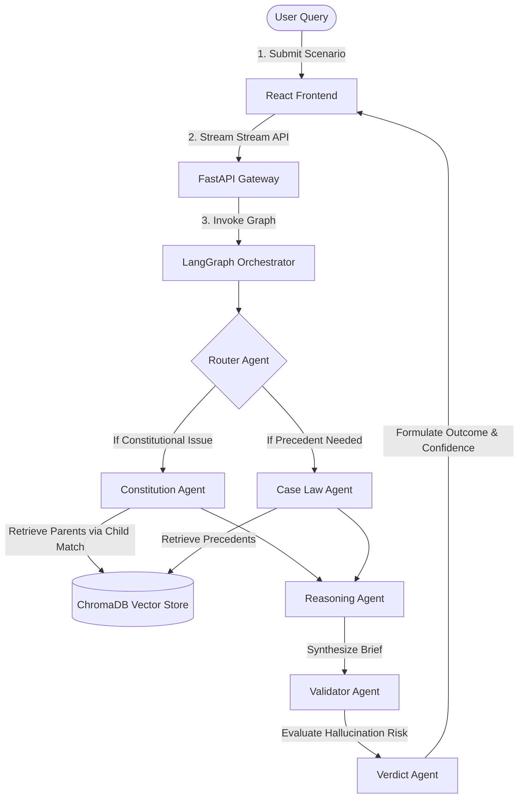

# Vidhi.AI - Constitutional Law Multi-Agent RAG Assistant

Vidhi.AI is a state-of-the-art AI-powered legal assistant designed to systematically analyze real-world scenarios under Indian Constitutional Law. It maps complex legal disputes directly to constitutional articles, relevant clauses, fundamental rights, landmark Supreme Court judgments, and logical verdicts.

Unlike generic chat assistants, Vidhi.AI is built on an **Agentic RAG workflow** utilizing **LangGraph state orchestration**, **hierarchical parent-child document chunking**, and a dedicated **Validator agent guardrail** to eliminate hallucinations and secure high precision.

---

## 🚀 Key Features

* **Hierarchical Parent-Child RAG:** Indexes detail-rich child clauses and key judgment keywords in ChromaDB for high-similarity semantic retrieval, then maps matches back to full parent articles to preserve comprehensive legal context for LLM reasoning.
* **Hybrid Vector & Keyword Search:** Fuses dense vector search with lexical BM25 matching to retrieve exact constitutional statutes and citations.
* **Multi-Agent LangGraph Architecture:** Coordinates specialized agents (Router, Constitution, Case Law, Reasoning, Validation, and Verdict) in a stateful execution graph.
* **Autonomous Validator Guardrails:** An independent validation agent checks generated reasoning against source texts, scoring hallucination risks and calculating confidence.
* **Real-time Agent Streaming:** Renders live, granular state updates of the active agent workflow timeline on the frontend.
* **Legal Memorandum Generation:** Features a toggleable "Formal Legal Brief" layout resembling a official legal document, complete with print and PDF export optimization.
* **Dockerized Production Deployment:** Fully dockerized backend (Uvicorn/FastAPI) and frontend (Vite/React with custom Nginx fallback reverse proxies).

---

## 🏛️ System Architecture



---

## 📸 Application Interface Screenshots

*Below are placeholders mapping the visual layouts of the production frontend:*

* **Landing Page:**
  * Displays a premium dark-themed hero workspace, description of the Multi-Agent engine, and a list of 10 presets for immediate testing.
  * `[Placeholder: Landing Page Screenshot - Mockup /public/landing_page.png]`
* **Query Workspace:**
  * The central search console showing user query inputs and active backend health checkers.
  * `[Placeholder: Query Workspace Screenshot - Mockup /public/query_workbench.png]`
* **Agent Timeline Stream:**
  * Real-time progress bar detailing state transition events of each active node (e.g. Router active, Researching ChromaDB, Synthesizing reasoning).
  * `[Placeholder: Active Timeline Stream Screenshot - Mockup /public/agent_timeline.png]`
* **Legal Answer & Report page:**
  * Split view between a dashboard metrics panel and a printable serif-styled legal memorandum with a "Print / Save PDF" trigger.
  * `[Placeholder: Legal Brief Report Screenshot - Mockup /public/legal_brief_report.png]`

---

## 📝 Example Demo Evaluation

### User Dispute Input
> *"Can the police search my personal mobile phone without permission?"*

### Orchestrator Response Lifecycle
1. **Router Classification:** Flags category as **Privacy & Personal Liberty**.
2. **Statutory Reference:** Article 21 is retrieved (Right to Life and Personal Liberty).
3. **Precedent Citation:** *Justice K.S. Puttaswamy v. Union of India (2017)* is retrieved.
4. **Synthesized Legal Brief:**
   * **Legal Issue:** Protection of digital privacy under Article 21.
   * **Applicable Articles:** Article 21 (Right to life and liberty includes the right to privacy).
   * **Judgments:** *Justice K.S. Puttaswamy (2017)* (established privacy as an intrinsic fundamental right).
   * **Reasoning:** A search of a private mobile device contains personal data protected under Article 21. Any state wiretapping or physical search must satisfy the three-fold test: (a) legality (existence of law), (b) necessity and proportionality, and (c) a legitimate state objective. Warrantless search without specific statutory emergency criteria violates this test.
   * **Validation:** Verified (100% citation mapping match; low hallucination risk).
   * **Possible Verdict:** State seizure or search of a phone without a judicial warrant is unconstitutional and violates Article 21.
   * **Confidence Level:** High.

---

## 🛠️ Technology Stack

* **Frontend:** React 19, Vite, Tailwind CSS (v4 theme configuration), Lucide Icons.
* **Backend:** FastAPI, Python 3.12, Uvicorn, LangGraph, LangChain Core.
* **AI Engine:** Google Gemini Pro models (`gemini-1.5-flash` / `gemini-1.5-pro` for deep legal reasoning).
* **Database:** ChromaDB (persistent vector storage) with Sentence-Transformers embeddings.
* **Deployment:** Docker & Docker Compose (Production multi-stage compilation).

---

## ⚙️ Installation & Setup

### Environment Variables
Create a `.env` file in the root workspace directory:
```ini
# Gemini API Key (Required for LLM synthesis)
GOOGLE_API_KEY=your_gemini_api_key_here

# Embedding Config (Optional, defaults to sentence-transformers locally)
EMBEDDING_PROVIDER=sentence-transformers
```

### Local Development Setup

#### 1. Backend Server
```bash
cd backend
python -m venv venv
# Windows powershell:
.\venv\Scripts\Activate.ps1
# Mac/Linux:
source venv/bin/activate

pip install -r requirements.txt
uvicorn app.main:app --host 0.0.0.5 --port 8000 --reload
```

#### 2. Frontend Development
```bash
cd frontend
npm install
npm run dev
```
Open `http://localhost:5173` to explore the workbench.

---

### Docker Deployment Setup
To build the images and run backend and frontend containers concurrently:
```bash
docker compose up -d --build
```
* **Frontend Web App:** Available on Port `80` (or proxy configured port).
* **Backend API Swagger:** Available on `http://localhost:8000/docs`.

To tear down services:
```bash
docker compose down -v
```

---

## 🗺️ Future Roadmap

- [ ] **Judgment Database Expansion:** Increase indexing from 200+ cases to 10,000+ Supreme Court and High Court verdicts.
- [ ] **Multilingual Legal Support:** Enable query submission and document outputs in regional Indian languages (Hindi, Tamil, Marathi, etc.).
- [ ] **Voice Interface:** Integrate speech-to-text input to allow verbal scenario descriptions and vocal summaries.
- [ ] **Comparative Constitutional Mapping:** Connect rights queries to international constitutional provisions (e.g. US Bill of Rights, South African Constitution).
- [ ] **User Case Accounts:** Allow lawyers and researchers to log in, save briefs, and generate collaborative case folders.