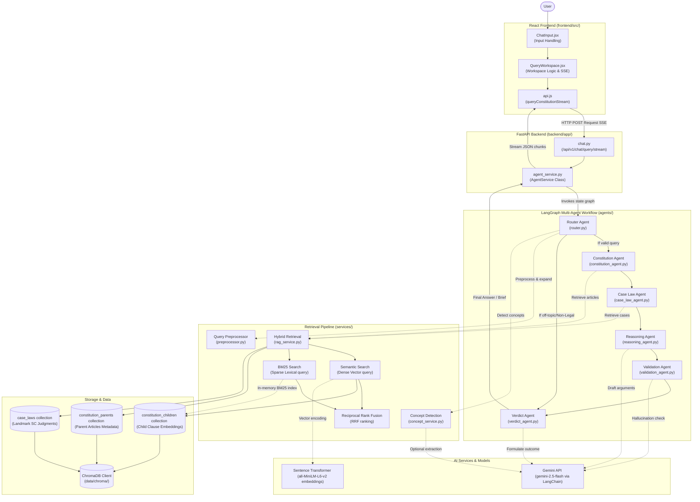
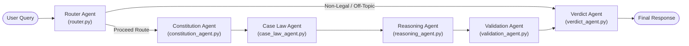

# Vidhi.AI - Constitutional RAG Assistant

Vidhi.AI is a state-of-the-art, AI-powered legal assistant designed to systematically analyze real-world scenarios under Indian Constitutional Law. It maps complex legal disputes directly to constitutional articles, relevant clauses, fundamental rights, landmark Supreme Court judgments, and structured legal reasoning to generate objective verdicts.

Unlike generic chat assistants, Vidhi.AI is built on an **Agentic RAG workflow** utilizing **LangGraph state orchestration**, **hierarchical parent-child document chunking**, and a dedicated **Validator agent guardrail** to eliminate hallucinations and secure high precision.

---

## 🏛️ System Architecture

Vidhi.AI utilizes a modular, multi-tier architecture to securely intake, preprocess, retrieve, reason, and validate legal queries. The diagram below represents the complete flow of data and execution from the user interface down to storage, retrieval pipelines, and language models:



### Architectural Layers

- **Presentation Layer (React Frontend)**: Processes user queries via `ChatInput.jsx`. The page `QueryWorkspace.jsx` coordinates query state, renders the streaming execution steps on `AgentTimeline.jsx`, and fetches data via `api.js` using Server-Sent Events (SSE) stream readers.
- **API Service Layer (FastAPI Backend)**: Defines the core communication endpoints in `endpoints/chat.py`. The `AgentService` class acts as the bridge that sets up the `AgentState` context, triggers the state graph, and captures graph stream updates.
- **State Orchestration Layer (LangGraph Workflow)**: Compiles and runs a directed acyclic graph defining node transitions. If a query is found to be off-topic, the graph dynamically routes around retrieval components directly to final formatting.
- **Legal Intelligence & Retrieval Layer**: Sanitizes inputs and matches legal concepts against predefined rules using `concept_service.py` and `preprocessor.py`. The modular `rag_service.py` runs semantic search (using Chroma vector scores) and keyword search (via an in-memory BM25 index), fusing the resulting ranks using Reciprocal Rank Fusion (RRF) and boosting matching concepts before fetching structural parent articles.
- **Storage & Vector Data Layer**: Maintains persistent collections in ChromaDB. Granular child text segments are stored in the children collection, while structural legal hierarchies live in the parent collection, and historic precedents live in the case laws collection.
- **AI Core (LLM & Embeddings)**: Encodes text queries into dense vector coordinates using lazy-loaded sentence-transformer models (`all-MiniLM-L6-v2`). Synthesizes deep legal reasoning, validates structural factual consistency to counter hallucinations, and structures the final response report using the `gemini-2.5-flash` model.

---

## ⚖️ Agent Execution Flow

The legal analysis state graph coordinates state modifications and routes queries along the following paths depending on relevance:



### Workflow Node Functions
1. **Router Agent**: Extracts query categories, normalizes legal issues, and validates query subject relevance (bypasses retrieval if off-topic).
2. **Constitution Agent**: Retrieves the top relevant constitutional clauses from ChromaDB.
3. **Case Law Agent**: Gathers landmark Supreme Court precedents relevant to the query and retrieved articles.
4. **Reasoning Agent**: Integrates retrieved laws and precedents using Gemini to synthesize legal arguments (For & Against).
5. **Validation Agent**: Compares generated reasoning directly against raw database sources to prevent hallucinations.
6. **Verdict Agent**: Predicts a potential legal outcome, determines a confidence score, and compiles the final Markdown brief.

---

## 🚀 Features

- **Constitutional Article Retrieval:** Automatically maps legal scenarios to exact constitutional provisions.
- **Landmark Case Law Retrieval:** References key historical Supreme Court decisions and precedents (e.g., *Puttaswamy*, *Kesavananda Bharati*).
- **Hybrid Search (Dense + BM25):** Fuses semantic dense vector matching with BM25 keyword matching for maximum precision.
- **Parent-Child RAG Retrieval:** Indexes granular child clauses/contexts while retrieving full parent articles to preserve comprehensive context.
- **Multi-Agent Reasoning:** Orchestrates specialized agents (Router, Reasoning, Validation, Verdict) via LangGraph.
- **Validation Agent Guardrails:** Automatically evaluates generated legal claims against source materials to mitigate LLM hallucinations.
- **Gemini LLM Integration:** Integrates with the Google Gemini API (`gemini-2.5-flash`) for deep legal reasoning.
- **Legal Brief Generation UI:** Beautiful, responsive React interface that displays a live agent execution timeline and formats answers as an exportable formal legal brief.

---

## 🛠️ Tech Stack

### Backend
- **Python 3.10+** (tested on `3.12.10`)
- **FastAPI:** High-performance web framework for APIs.
- **LangGraph & LangChain:** Stateful agent orchestration and LLM integrations.
- **ChromaDB:** Local vector database.
- **Sentence Transformers:** Embedding generation (using `all-MiniLM-L6-v2` locally).
- **Google Gemini API:** Context synthesis and reasoning.

### Frontend
- **React & Vite:** Fast, modern single-page application framework.
- **Tailwind CSS:** Premium styling, dark-theme layout, and print-optimized legal memorandum stylesheet.

---

## 📁 Project Structure

```
Indian-Constitution/
├── backend/
│   ├── app/
│   │   ├── agents/          # Specialized LangGraph agents (Router, Reasoning, Validation, etc.)
│   │   ├── api/             # FastAPI endpoints (v1 routes, health check)
│   │   ├── core/            # Configuration and settings
│   │   ├── db/              # ChromaDB vector store clients and seed checkers
│   │   ├── prompts/         # Base prompt templates for agents
│   │   ├── schemas/         # Pydantic models for API requests/responses
│   │   ├── services/        # Business logic services (Concept classification, etc.)
│   │   └── main.py          # FastAPI application entry point
│   ├── data/                # Ingested datasets and local database files
│   ├── scripts/             # Seeding, ingestion, and agent benchmarking scripts
│   ├── Dockerfile
│   └── requirements.txt
├── frontend/
│   ├── src/
│   │   ├── components/      # UI components (AgentTimeline, LegalBrief, etc.)
│   │   ├── pages/           # Page layouts (Landing, QueryWorkspace, etc.)
│   │   ├── services/        # API communication scripts
│   │   ├── App.jsx          # Root component
│   │   └── main.jsx         # App entry point
│   ├── package.json
│   ├── vite.config.js
│   └── tailwind.config.js
├── docs/                    # Centralized project documentation
│   ├── AGENTS.md
│   ├── agent_system.md
│   ├── architecture.md
│   ├── deployment.md
│   ├── implementation_plan.md
│   ├── rag_pipeline.md
│   ├── README_DOCKER.md
│   ├── roadmap.md
│   ├── tech_stack.md
│   └── testing.md
├── tests/                   # Core Python testing suites
│   ├── test_gemini_reasoning.py
│   ├── test_knowledge_coverage.py
│   └── test_legal_intelligence.py
├── database/
│   └── schema.md            # Metadata and schema definition
├── docker-compose.yml
├── .gitignore
├── .env.example
└── README.md                # Project entry documentation
```

---

## ⚙️ Environment Setup

Before running the application, configure your environment variables. 

Create a `.env` file inside the `backend` directory (refer to [backend/.env.example](file:///c:/Users/ramsa/Desktop/Indian%20Constitution/backend/.env.example)):
```env
GOOGLE_API_KEY=your_gemini_api_key_here
GEMINI_MODEL=gemini-2.5-flash
EMBEDDING_PROVIDER=local
LOCAL_EMBEDDING_MODEL=all-MiniLM-L6-v2
BACKEND_CORS_ORIGINS=["*"]
```

---

## 🚀 Installation & Running the Project

### 1. Run Backend Natively

Navigate to the `backend` directory, set up your Python virtual environment, install dependencies, and start the development server:

```bash
cd backend
python -m venv venv

# Activate Environment:
# On Windows (PowerShell):
.\venv\Scripts\Activate.ps1
# On Linux/macOS:
source venv/bin/activate

# Install dependencies:
pip install -r requirements.txt

# Ingest and Seed Database (Run once):
python scripts/ingest_data.py

# Start FastAPI:
uvicorn app.main:app --reload
```
The backend API will run locally on `http://localhost:8000`. You can inspect the Swagger interactive UI at `http://localhost:8000/docs`.

### 2. Run Frontend Natively

Open a new terminal, navigate to the `frontend` directory, install Node packages, and start Vite:

```bash
cd frontend
npm install
npm run dev
```
The frontend web application will run locally on `http://localhost:5173`.

---

## 📝 Demo Query Examples

Try pasting these example scenarios into the web application to see Vidhi.AI's reasoning in action:

- **Privacy & Arrest:** *"Can the police search my personal mobile phone without a warrant during a routine check?"*
- **Freedom of Expression:** *"Can the government ban a peaceful student assembly protesting against a new local policy?"*
- **Religious Freedoms:** *"Can a state government restrict dress codes in state-funded schools under religious claims?"*
- **Off-topic Guardrail:** *"How do I bake a chocolate cake at home?"* (Asserts off-topic filtering and validation rejection)

---

## 🧪 Testing

The repository includes a comprehensive verification suite located in the `tests/` directory:

- **RAG & Coverage Benchmark (50 Cases):** Evaluates system retrieval accuracy over 50 real-world scenarios across 13 domains.
  ```bash
  python tests/test_knowledge_coverage.py
  ```
- **Agent Integration Test:** Compares Multi-Agent output results using Gemini augmentation against static rules.
  ```bash
  python tests/test_gemini_reasoning.py
  ```
- **Legal Concept Parsing Test:** Verifies query parsing, keyword extraction, and concept mapping.
  ```bash
  python tests/test_legal_intelligence.py
  ```
- **Frontend Validation:** Build compilation check to confirm bundle health.
  ```bash
  cd frontend && npm run build
  ```

---

## 🔮 Future Improvements

- **Larger Legal Database:** Indexing 10,000+ Supreme Court and High Court full-text judgments.
- **Multilingual Support:** Support queries and generated legal briefs in major Indian languages (Hindi, Bengali, Tamil, etc.).
- **Voice Interface:** Voice-to-text querying and read-aloud spoken summaries of legal briefs.
- **Citation Verification:** Deep linking each retrieved case directly to official Indian Kanoon or Supreme Court portal documents.

---

## 📄 License

This project is licensed under the MIT License. See [LICENSE](LICENSE) for details.